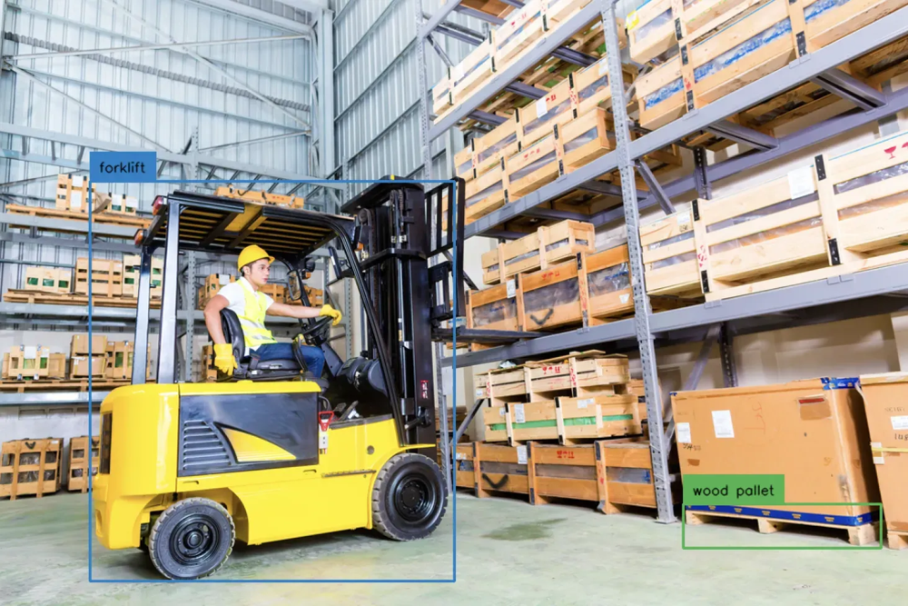

# 🎥 Detector Multiclase con YOLOv8

> Una mini-lección práctica para aprender detección de objetos en video con YOLOv8, en camino a modelos avanzados como SmolVLM.

---

## 🧠 ¿De qué se trata?

Este proyecto surge como una respuesta al reciente auge de los modelos de **detección en tiempo real** y **Vision-Language Models (VLMs)** como **SmolVLM**.

En lugar de ofrecer una receta cerrada, esta implementación es una **lección práctica e interactiva**, con la intención de ayudar a entender cómo funciona internamente un sistema de detección basado en vídeo. Desde cómo se procesa el video, se detectan objetos y se filtran las clases, hasta cómo se visualiza el resultado final.

💡 Este proyecto está pensado como un **primer paso lógico** y accesible antes de abordar arquitecturas más complejas como SmolVLM.

---

## 🎯 ¿Qué hace?

* Detecta objetos en un video utilizando **YOLOv8 preentrenado**
* Usa una interfaz **Gradio** para subir y procesar tu propio video fácilmente
* Lista y visualiza todas las clases detectadas en pantalla
* Excluye manualmente algunas categorías poco relevantes (editable)

Por defecto, el sistema detecta **todas las clases del dataset COCO**, excepto unas pocas como `hot dog`, `skateboard`, `laptop`, etc.
Podés **modificar fácilmente la lista `EXCLUDED_CLASSES`** en el notebook para ajustar qué se detecta y qué no.

---

## 🛠️ Tecnologías utilizadas

| Herramienta           | Función principal                        |
| --------------------- | ---------------------------------------- |
| YOLOv8 (Ultralytics)  | Modelo de detección de objetos           |
| OpenCV                | Procesamiento de frames de video         |
| PyTorch               | Backend de inferencia                    |
| Gradio                | Interfaz web para pruebas                |
| NumPy                 | Procesamiento de datos                   |
| Hugging Face Datasets | Referencia para nombres de clases (COCO) |

---

## 📂 Estructura del repositorio

```
Product_Detector_YOLOv8/
├── Yolov8_Detector.ipynb        # Notebook principal (en español)
├── requirements.txt             # Dependencias necesarias
├── sample_gondola_video.mp4     # Video de ejemplo
├── assets/                      # Visuales para documentación
│   ├── cheap.png
│   ├── detect.png
│   └── tolo-v8.png
```

---

## 🚀 Cómo usarlo

1. Abrí el notebook en [Google Colab](https://colab.research.google.com/)
2. Montá tu Google Drive con la primera celda
3. Ejecutá la instalación de dependencias con `requirements.txt`
4. Cargá tu video o usá el de ejemplo (`sample_gondola_video.mp4`)
5. Ejecutá la interfaz y observá cómo se listan los objetos detectados

---

## 🧪 Personalización

Podés editar la lista de clases excluidas modificando esta línea:

```python
EXCLUDED_CLASSES = ["apple", "orange", "hot dog", "skateboard", "laptop"]
```

Si querés detectar **absolutamente todo**, simplemente dejala vacía:

```python
EXCLUDED_CLASSES = []
```

---

## 🧭 ¿Qué viene después?

Este proyecto funciona como una introducción perfecta para luego abordar modelos visión-lenguaje como:

* SmolVLM
* MiniCPM-V2
* Qwen-VL
* OpenFlamingo

🧠 Una vez que comprendas el pipeline completo de detección con vídeo, estarás listo para trabajar con modelos que **no solo ven, sino que también entienden**.

---

## 📸 Visuales del proyecto



---

## ✍️ Autor

**Gonzalo Romero**
`DeepRat (HermesIA)`
📍 AI Engineer, Educador Técnico & Hacker Ético de Datos
🔗 [LinkedIn](www.linkedin.com/in/gonzalo-romero-b9b5b4355) •

---

## 📚 Recursos relacionados

* 🧠 Próxima lección: [SmolVLM con cámara en vivo en tiempo real](https://github.com/ngxson/smolvlm-realtime-webcam)
* 📖 Artículo explicativo en LinkedIn: *[Disponible aquí]([https://www.linkedin.com/posts/tu-articulo](https://www.linkedin.com/pulse/detecci%25C3%25B3n-de-objetos-en-video-con-yolov8-gu%25C3%25ADa-pr%25C3%25A1ctica-gonzalo-romero-qr4of))*

---

## 🪪 Licencia

Este proyecto se distribuye bajo la **Licencia MIT**.
Podés usarlo, modificarlo, compartirlo y adaptarlo libremente.

---

## 🧠 ¡Aprendé, modificá y detectá!

> Si querés saber qué es lo que ve la IA, este es tu punto de partida.

---
